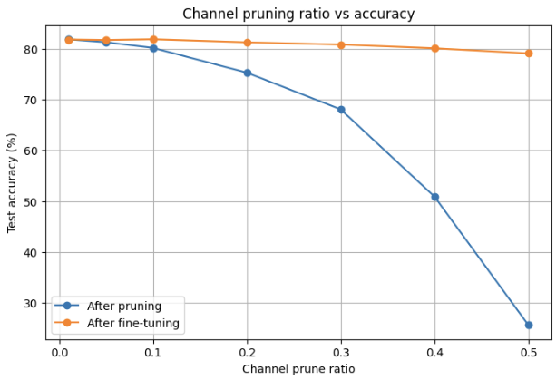
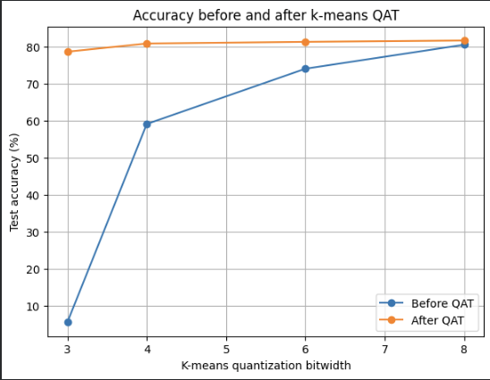
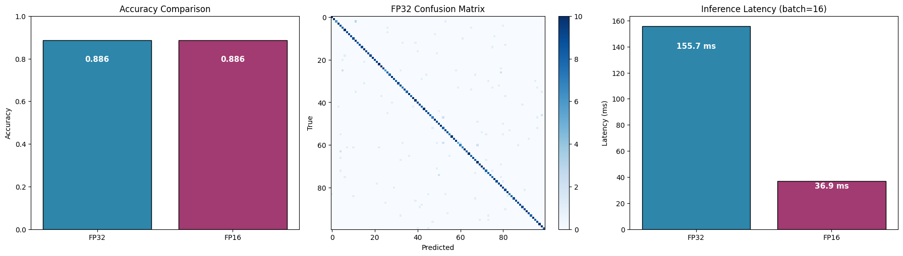

# Model Compression on CIFAR-100 using Pruning and Quantization of both Conventional Neural Network and Quantization only on a Vision Transformer model

This project investigates neural network compression techniques on a ResNet-18 model trained on CIFAR-100.  
The goal is to reduce model size and computational cost while preserving classification accuracy.

## Project Overview

The primary experiments focus on:

1. Channel pruning
2. K-means weight quantization with quantization-aware fine-tuning (QAT)

Additionally, we include exploratory experiments with transformer pruning.

The main trade-off studied is:

> How much can we compress the model before accuracy drops too much?

---

## Model and Dataset

- Dataset: CIFAR-100
- Model: ResNet-18
- Baseline accuracy: 81.9%
- Evaluation metric: test accuracy

Efficiency metrics:
- number of parameters
- model size
- MACs / computational cost
- compression ratio

---

## Methods

### 1. Fine-grained Pruning


- The model contained substantial parameter redundancy.
- Even after severe pruning, fine-tuning techniques recovered most of the lost performance.
- Although most weights were pruned, computational cost remained almost unchanged because the model structure itself was not modified.
- Compared to channel pruning, fine-grained pruning can produce higher sparsity but less practical inference acceleration.

### 2. Channel Pruning

Entire convolutional channels are removed from the network.  
This reduces the size of intermediate feature maps and decreases the number of multiply-accumulate operations (MACs), resulting in lower computational cost.

### Accuracy vs MAC Reduction



The model preserves relatively high accuracy even after moderate MAC reduction.  
More aggressive pruning eventually leads to larger performance degradation.

---

### Channel Pruning Before and After Fine-Tuning


Fine-tuning substantially recovers performance after pruning, especially at higher pruning ratios.

---

### 3. K-Means Quantization with QAT

Weights are clustered into a smaller number of shared values.  
Instead of storing every weight as a 32-bit floating point value, each weight stores an index to a centroid.

We tested:
- 8-bit
- 6-bit
- 4-bit
- 3-bit quantization

Lower bitwidths provide stronger compression, but usually increase accuracy loss.

### Quantization Before and After QAT



Quantization-aware training (QAT) significantly improves low-bitwidth performance.

---

## Evaluation Metrics

Different compression methods optimize different deployment constraints.

### Why MAC reduction for pruning?

Channel pruning changes the network architecture by removing channels.  
This directly reduces the number of multiply-accumulate operations (MACs), which affects inference speed and computational cost.

### Why compression ratio for quantization?

Quantization primarily changes how weights are represented in memory.  
This reduces model storage size, but does not necessarily reduce the number of operations performed during inference.

Because of this:
- pruning is evaluated using MAC reduction
- quantization is evaluated using model size reduction

---

## Results

Baseline ResNet-18 accuracy: 81.9%

### Channel Pruning Results

| Prune ratio | Accuracy after pruning | Accuracy after fine-tuning | MAC reduction |
|---:|---:|---:|---:|
| 0.01 | 81.84% | 81.80% | 1.05% |
| 0.05 | 81.27% | 81.70% | 4.50% |
| 0.10 | 80.16% | 81.85% | 9.12% |
| 0.20 | 75.29% | 81.26% | 18.56% |
| 0.30 | 68.07% | 80.81% | 27.55% |
| 0.40 | 50.90% | 80.08% | 36.98% |
| 0.50 | 25.66% | 79.09% | 46.11% |

### Key Findings

- The model preserved over 80% accuracy up to roughly 35% MAC reduction after fine-tuning.
- Fine-tuning substantially recovered accuracy after aggressive pruning.
- At 50% pruning, accuracy improved from 25.66% to 79.09% after retraining.

---

### K-Means Quantization with QAT

| Bitwidth | Accuracy before QAT | Accuracy after QAT | Size reduction |
|---:|---:|---:|---:|
| 8 | 80.59% | 81.73% | 4.00x |
| 6 | 74.10% | 81.37% | 5.33x |
| 4 | 59.13% | 80.92% | 8.00x |
| 3 | 5.49% | 78.70% | 10.67x |

### Key Findings

- Quantization-aware training (QAT) significantly improved low-bitwidth performance.
- 4-bit quantization achieved an 8× model size reduction while maintaining over 80% accuracy.
- 3-bit quantization was too aggressive without QAT, but retraining restored much of the lost accuracy.

---

## Compression Trade-Offs

Different compression methods optimize different deployment constraints.

| Method | Main Benefit | Main Trade-off |
|---|---|---|
| Channel pruning | Lower MACs and faster inference | Accuracy degradation |
| K-means quantization | Strong model size reduction | Limited compute reduction |
| Fine-grained pruning | High sparsity | Limited practical speedup |

---
## Vision Transformer (ViT) Quantization Results

We also tested a Vision Transformer (ViT Base) on CIFAR 100 using FP16 mixed precision. The results suggest that, at least for this model and dataset, FP16 is a solid optimization—fast and lossless.

### ViT Performance Summary

| Precision | Accuracy | Mean Latency (ms) | Throughput (img/s) | Speedup |
| :--- | :--- | :--- | :--- | :--- |
| **FP32** | 88.60% | 155.7 | 102.8 | 1.00x |
| **FP16** | 88.60% | 36.9 | 434.2 | 4.23x |



### How FP16 Was Applied

- Quantization to FP16 was applied globally to both weights and activations during evaluation.
- **Linear layers**: All fully connected layers inside the transformer blocks (feed‑forward networks and projection layers) were converted to 16‑bit floats.
- **Attention mechanisms**: Query, key, and value matrices, as well as the attention score computations, ran in FP16.
- **Embeddings**: Patch embeddings and position embeddings were cast to FP16.
- Under the hood, `model.half()` converted stored weights, while `torch.autocast` handled dynamic casting of activations.
- A nuance worth noting: operations like layer normalization and the softmax inside each attention head were often kept in FP32 by the system to maintain numerical stability. That careful trade‑off likely explains why accuracy stayed identical to the baseline.

### What We Noticed

- **Zero accuracy drop** – FP16 preserved the full 88.60% baseline without any fine‑tuning. That said, this might not hold for more sensitive tasks like object detection.
- **4.23x speedup** – Latency fell from 155.7 ms to 36.9 ms per sample. On compatible hardware, that difference turns a research toy into something deployable for real‑time use.
- **No retuning required** – Unlike aggressive 8‑bit schemes, FP16 just worked out of the box. Still, we should be cautious: rounding errors can accumulate in longer sequences or shallower models.
## Repository Structure

```text
Make-it-small
│
├── README.md
├── requirements.txt
│
├── notebooks/
│   ├── pruning_quantization_experiments.ipynb
│   └── transformer_pruning_experiments.ipynb
│
├── results/
│   ├── accuracy_vs_macs.png
│   ├── channel_pruning_before_after_finetuning.png
│   ├── quantization_before_after_qat.png
    ├── Vit-quant.png
│   └── csv/
│
└── docs/
